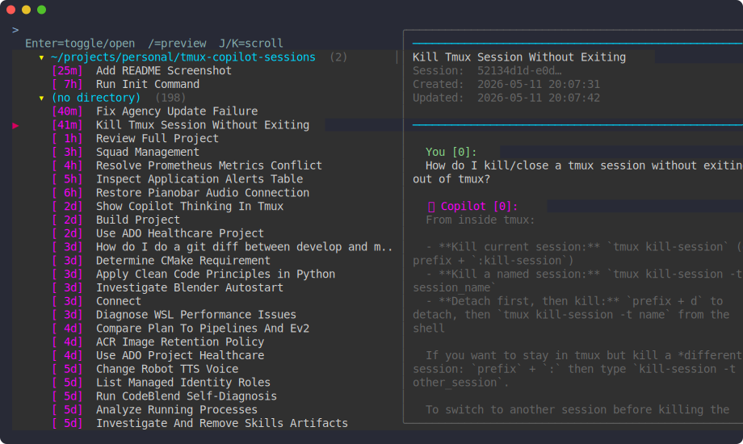

# tmux-copilot-sessions

> Browse and resume GitHub Copilot CLI sessions directly from tmux

One keypress (`Prefix + g`) opens a floating popup listing every Copilot
conversation, grouped by project directory, with a live preview on the right.
Select one to instantly resume it in a new tmux window, cd'd to the project.



## Install

### TPM

```tmux
set -g @plugin 'alanyackel/tmux-copilot-sessions'
# set -g @copilot_sessions_command 'agency copilot'  # if using a wrapper
```

Press `Prefix + I` to install.

### Manual

```bash
git clone <repo-url> ~/projects/personal/tmux-copilot-sessions
```

Add to `~/.config/tmux/tmux.conf`:

```tmux
run-shell ~/projects/personal/tmux-copilot-sessions/tmux-copilot-sessions.tmux
```

Reload: `tmux source ~/.config/tmux/tmux.conf`

## Requirements

| Dependency | Version | Notes |
|------------|---------|-------|
| tmux | ≥ 3.2 | For `display-popup` |
| fzf | any | Fuzzy finder |
| Python | 3.x | Reads session database |
| Copilot CLI | any | `copilot` in `$PATH` |

## Configuration

| Option | Default | Description |
|--------|---------|-------------|
| `@copilot_sessions_key` | `g` | Trigger key (Prefix + key) |
| `@copilot_sessions_popup_width` | `80%` | Popup width |
| `@copilot_sessions_popup_height` | `75%` | Popup height |
| `@copilot_sessions_db` | `~/.copilot/session-store.db` | Session database path |
| `@copilot_sessions_command` | `copilot` | Command to invoke (e.g. `agency copilot`) |

## Keybindings

Inside the popup:

| Key | Action |
|-----|--------|
| `Enter` | Open/resume selected session; toggle group if on a directory header |
| `Esc` / `Ctrl-c` | Close popup |
| `↑`/`↓` or `Ctrl-k`/`Ctrl-j` | Move selection |
| `J` / `K` | Scroll preview down/up |
| `g` / `G` | Preview top/bottom |
| `Ctrl-d` / `Ctrl-u` | Half-page down/up |
| `/` | Toggle preview |
| Type anything | Fuzzy-filter sessions |
